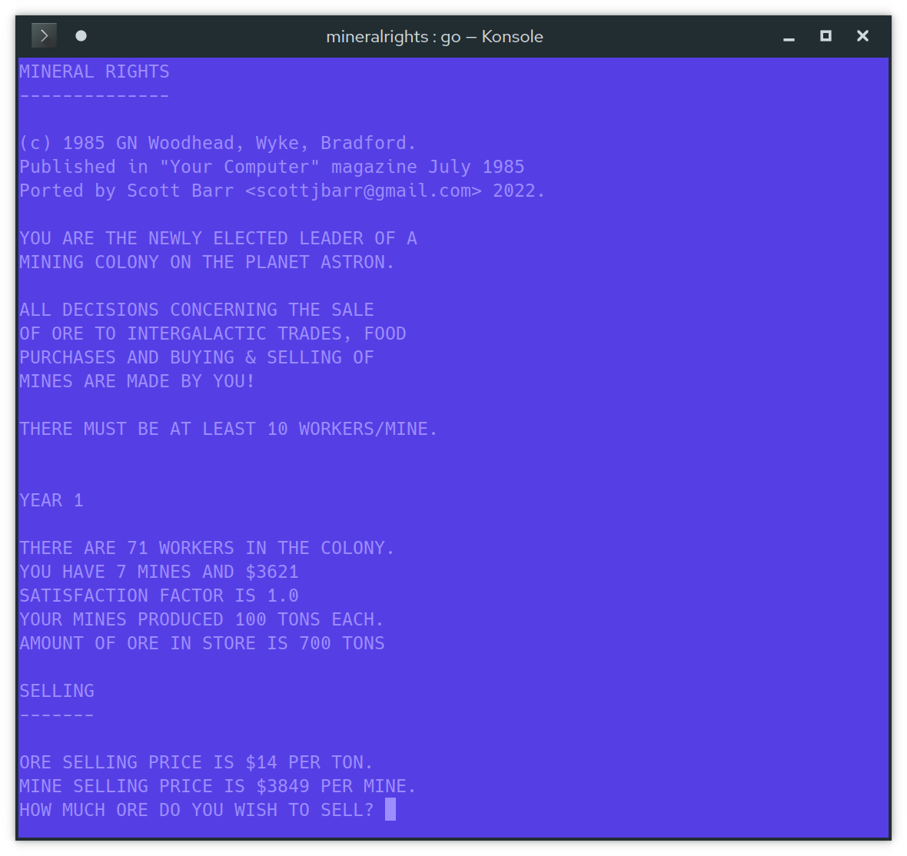

# Mineral Rights

This is Go a port of "Mineral Rights", a C64 game that was published in "Your Computer" magazine in
July 1985.

> This is an adventure-type game. You are the leader of a mining colony in outer space and have to
> make decisions concerning the welfare of the planet. Full instructions are included within the
> program.

I used to enjoy playing around with this game when I was a kid.

Recently I remembered it so after a quick search I found a PDF of the magazine online and decided to
port it to Go for some fun.  I haven't dealt with control characters, or changing the screen colour
or any C64 specifics.  I've left all game text as-is with the exception of adding a copyright notice
to pay attribution to the original authors, and showing the updated balance whenever you buy or sell
anything.

Anyone from the C64 era probably remembers typing in code listings from magazines and hoping it all
worked ok.  Learning from these listings was always fun, and sometimes frustrating.  The end result
for me was a career in software development.

You can read the [original code listing](./docs/mineral-rights.bas) as I transcribed it.  I added
markers for control characters e.g. `{{DOWN}}`

Not convinced? Feel the nostalia with the game shown in C64 default colours.



## Build

Build the binaries for all OS'es.

```
make
```

## Install

### Code

Clone the repo run it.

```
git clone https://github.com/scottjbarr/mineralrights.git
cd mineralrights
go run cmd/mineralrights/main.go
```

### Install Binary with Go

```
go install github.com/scottjbarr/mineralrights/cmd/mineralrights@latest
mineralrights
```

### Binary Only

Find binary only installs in [Releases](../../releases)

## References

- http://www.c64music.co.uk/mags/
- http://www.gb64.com/game.php?id=15970
- http://www.retro8bitcomputers.co.uk/magazines/GetMagazine?name=Your%20Computer
- https://archive.org/stream/your-computer-magazine-1985-07/YourComputer_1985_07_djvu.txt
- https://www.c64-wiki.com/wiki/control_character
- https://store.kde.org/p/1219659/
